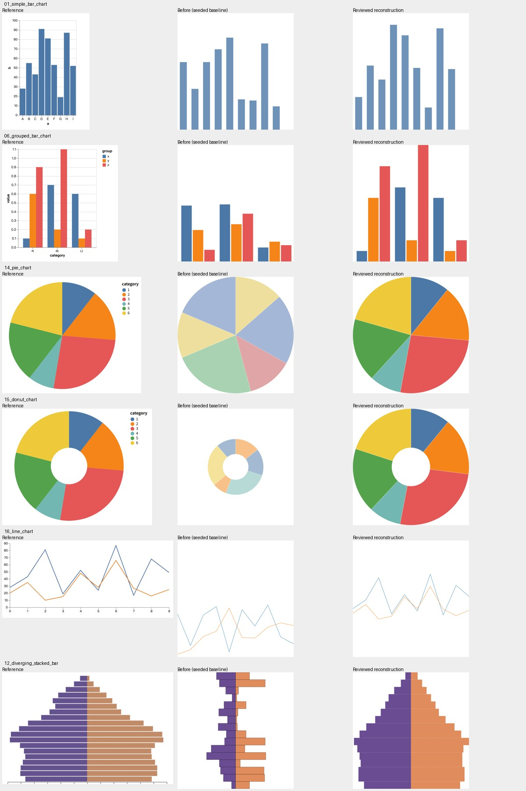
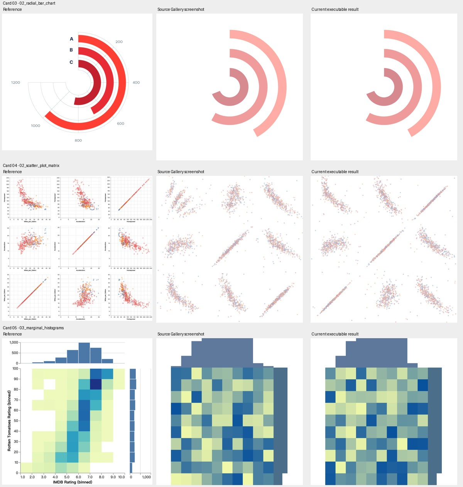

# Reviewed reference-pattern examples

Thirteen gallery examples were selectively updated from the recovery artifacts in
[Selvalim/ReVis, commit 5b83bd4](https://github.com/Selvalim/ReVis/tree/5b83bd4/gallery/public/recoveries).
The baseline is `same-lin/vitejs-d3` commit `e7020e3`. Another example, line with area, was repaired locally using shared data (see below).
Stacked area also received a local range correction (see below).
EnsembleLens also received a local shared-data repair (see below).
Box plot, multiple areas, and LineUp received local scoped-color refinements (see below).
iForest also received a local link-rendering and reference-data repair (see below).
The other 20 canonical examples are unchanged.

These are **curated, approximate reconstructions of patterns visible in reference
images**, not recovered original datasets. The exported model results were
inspected and corrected as described below. They must not be reported as
uncorrected model outputs or used to change the paper's reported evaluation
scores. Existing axes, legends, annotations, and all source mark counts are not
necessarily reproduced by the renderer.

## Accepted cases, checked individually

The first six were selected after comparison. Gallery cards **03, 04, and 05**
were subsequently selected by the user: radial bar, scatterplot matrix, and
marginal histograms. These card numbers differ from the filenames.

| Case | Adopted data | Additional correction | Remaining limits |
| --- | --- | --- | --- |
| Simple bar | Nine heights: 28, 55, 43, 90, 81, 53, 19, 87, 52 | None; retain baseline DSL and bar layout | Heights are approximate readings from the image; axes/labels omitted |
| Grouped bar | 3 × 3 recovered heights | Multiply every value by 2 to map the exported 0–50 scale to the renderer's 0–100 scale; preserve category/series order | Rounded values; axes/labels omitted |
| Pie | Six relative weights: 11, 16, 27, 9, 18, 21 | Assign colors by category index, not random sampling; use opaque reference palette | Weights sum to 102 and are normalized to a circle, not asserted to be exact percentages |
| Donut | Six relative weights: 11, 16, 26, 9, 18, 20 | Fix category colors and opacity; set inner/outer radius to 0.33/1 to match the visible hole ratio and remove excessive whitespace | Approximate angular shares and hole ratio |
| Line | Two series of ten recovered observations | Move exported `x.anchor_values` to **y**; keep regularly increasing x; center the original 45%-height plot region | Piecewise linear approximation; no axes/labels |
| Diverging bars | Two sets of 16 widths | Reverse top-to-bottom source arrays for bottom-to-top renderer ordering; normalize both sides with the same factor 100/52; remove unwanted outlines | Retains the baseline's 16 rows; the reference contains more rows, so the silhouette is only approximate |

### Added user-selected cards 03–05

| Gallery card | Case | Imported behavior | Remaining limits |
| --- | --- | --- | --- |
| 03 | `02_radial_bar_chart` | Use exported angular sizes [69, 58, 42], preserving radial order and styling; persist the complete view | Keep the selected source approximation; not an exact reference angular measurement |
| 04 | `02_scatter_plot_matrix` | Implement the nine per-panel Gaussian-mixture configurations; map configurations in visual top-to-bottom, left-to-right order; retain 392 points per panel; correct the bottom-left self-comparison using the exported near-perfect positive-correlation configuration (index 2, retaining index 6 seed); persist points and styles | The source exported parameters, not original point coordinates or sampler code. Our sampler is documented below; it does not reproduce screenshot pixels exactly. Panels are independent approximations, not projections of a shared recovered multivariate dataset |
| 05 | `03_marginal_histograms` | Use both exported marginal-height arrays and persist the current central heatmap and colors | The heatmap has no recovered value field in the artifact; it retains the baseline generator. Marginals are not derived from the heatmap and should not be interpreted as a consistent joint distribution |

### Added user-selected cards 07, 08, 13, 15

| Gallery card | Case | Imported behavior | Remaining limits |
| --- | --- | --- | --- |
| 07 | Line with highlight | Twenty recovered trend values and two highlight intervals; line and dots bind to the same x/y fields | Approximate trend and highlight placement; no recovered original observations |
| 08 | Radial stacked bar | Exported 50 × 7 radial stack definition and values, replacing the baseline extra ring component | Source radius scaling and silhouette are an approximation |
| 13 | Scatter | Exported Gaussian mixture with negative correlation | Regenerated coordinates, not original point observations |
| 15 | Bubble 1 | Exported Gaussian mixture and six fixed outlier centers | Bubble sizes/styles retain DSL generation; no exact size recovery |

The Gallery hides container debugging guides; the editor retains its container controls.

A zero-valued rectangle now has zero height/width, rather than an artificial
10-pixel fallback. This matters for the zero entries in the selected marginals.

The complete, unmodified source artifact for each accepted case is in
[`sources/`](sources/). Model, prompt, timestamp, and exported DSL remain there
for audit. [`imported-cases.json`](imported-cases.json) records the source commit
and SHA-256 of each artifact. Its baseline hash is computed over Python's
`json.dumps(original, sort_keys=True)` UTF-8 representation, before curation.
The canonical executable documents live under `src/datav3/` and contain only
the adopted data and explicitly documented corrections.

## Why the remaining exported recoveries were not copied

| Cases | Decision |
| --- | --- |
| Faceted/grid bar | Defer: exported three-value array would repeat one pattern across distinct panels |
| Stacked bar | Defer: exported category shares flatten the reference's seasonal variation; baseline already has persisted data |
| Box plot | Defer: whiskers, boxes, and panel geometry need coordinated repair |
| Horizontal stacked bar | Defer: inspect row order, equal-total normalization, and segment proportions together |
| OpinionSeer | Defer: angular/radial structure and heatmap values are not faithful enough |
| BitExtract | Defer: link geometry must be verified in a real browser, not just ring segments |
| DropoutSeer | Defer: pie positions/sizes and row geometry need correction |
| Bubble 2 | Defer: reference bubble sizes and categorical distributions remain mismatched |
| 2D histogram scatter | Defer: point positions alone do not recover the reference's size-encoded diagonal density |
| CloudDet | Defer: orientation and heatmap pattern need coordinated verification |
| 2D histogram heatmap | Defer: Gaussian-field generator and color mapping require separate support and verification |
| Node-link | Defer: moving nodes without verifying their edges is insufficient |
| Strip; dot | Defer: counts, category positions, and empirical distributions need review |
| Line with dots | Defer: exported single-value curves collapse to flat lines |
| Line with area | Exported recovery remains deferred (flat curve); local example separately repaired using its existing line sample and shared references, as described below |
| Stacked area | Defer: matrix stacking, shared boundaries, and layer opacity need validation |
| Radar | Defer: two values do not encode seven independent radii per series |
| EnsembleLens | Defer: node radii and outer structure remain mismatched |

Eight of the 40 canonical examples have no exported recovery artifact:
parallel coordinates, mosaic, iForest, multiple bars, multiple stacked bars,
multiple areas, LineUp, and NameClarifier. Multiple areas and LineUp now have
local color refinements documented below; these are not recovered imports.

## Executable explicit values

`layout_specification.<axis>.data_values` supplies sizes and
`anchor_values` supplies anchor positions. Both use the renderer's local 0–100
units, including polar layouts before conversion to degrees/radii.

- `1D_LIST`: one number per mark.
- `2D_MATRIX` / `2D_LIST`: `[primary][secondary]` arrays, including ragged rows
  when the data structure declares them. There is no implicit broadcasting.
- Values must be finite and sizes non-negative. Mismatched array shapes fail
  with a descriptive error instead of silently reverting to random data.
- Stack sizes remain governed by the DSL's stacking/subdivision rules. Explicit
  anchors and stacking cannot be combined on the same axis.
- Explicit values initialize geometry. Existing persisted `view_data` and edited
  caches remain authoritative, so subsequent Data Control edits and history
  restore are preserved. Editing the DSL through the normal editor rebuilds
  the affected view using its existing transaction flow.
- `position_generator` and `instance_position_generators` now support
  `gaussian_mixture` for Cartesian 1D scatter plots with flexible center anchors.
  Instance configurations are matched to visual panel order, with exactly one
  configuration per panel. `value_generator` (heatmap fields) remains unsupported.

### Position sampler contract

`positionGenerator.ts` uses the existing `mulberry32-fnv1a-v1` PRNG with the seed
namespace `gaussian-mixture-v1:<source seed>`. Relative cluster/background weights
are normalized by their sum. Box–Muller normal pairs are transformed by the
specified spreads and correlation; generated centers are clipped to [0, 100].
The background component is uniform on that square. Categorical mark styling
uses an independent `position-style-v1:<source seed>` stream. This makes each
panel reproducible without depending on traversal order or another chart's RNG.
Existing persisted point/cache edits take precedence over generated positions, except for axes explicitly bound to a shared data source. Optional `outliers` reserve the final positions in the declared point count; the remaining positions are sampled.
The seven user-selected added cases include authoritative `view_data` snapshots and a fixed
metadata seed, so reloading also preserves nongenerated styling and heatmap values.

## Reference data, new samples, and shared fields

Gallery and Editor offer **Generate sample**, **New sample**, and **Restore reference**.
Reference is the default. Generated mode ignores inline fixed size/anchor arrays
during sampling without deleting them, and changes the generation seed. Gaussian
mixtures retain their pattern parameters while sampling new points. Declared
outliers remain fixed. Shared fields use their generator; fields without a
generator keep their reference values.

A first mode switch stores the reference definition, seed, and full view in
`reference_state`. Restore returns that exact view unless the DSL was edited,
in which case it rebuilds the updated reference definition. Save/reload and
Editor undo/redo preserve these states. Gallery changes are previews until Save;
Editor changes use its existing save transaction.

Card 07 defines one source and binds both line and dots to it:

```json
{
  "data_sources": {
    "trend": {
      "count": 3,
      "fields": {
        "x": { "values": [0, 50, 100], "generator": { "type": "sequence", "start": 0, "step": 50 } },
        "y": { "values": [20, 80, 40], "generator": { "type": "jitter", "amount": 8 } }
      }
    }
  }
}
```

Each consumer's data specification adds
`"data_ref": {"source": "trend", "x": "x", "y": "y"}`.
To share only x, use `"data_ref": {"source": "trend", "x": "x"}`;
y then follows that consumer's own layout/generation rules. Style and mark size
remain independent even when both coordinates are shared. This is field-level
sharing; selecting a subset of source rows is not currently supported.

The example above uses three observations for brevity; card 07 uses twenty.
A field is sampled once per document seed, source, and field, then reused by
every consumer. Sharing a range alone would not guarantee alignment.
Coordinates are local to each container: consumers must also have matching
container geometry to overlap visually.

Currently refs support numerical anchor and size fields on matching-count `1D_LIST`
marks; x/y and angle/radius bind positions. The corresponding `x_size`,
`y_size`, `angle_size`, and `radius_size` bind lengths in the same local 0–100 units.
Sizes must be non-negative and cannot also declare inline `data_values`. No implicit joins, resampling, or
matrix broadcasting are performed. A bound axis cannot also declare inline
anchor values or stacking. Generators support uniform, sequence, and jitter
around reference values (clipped to 0–100). Bound anchors and sizes override their saved view coordinates to maintain consistency. Editing a bound anchor or size through Data Control
updates the shared source and both consumers, returning to reference mode.
The combined all-properties editor rejects bound-anchor edits; edit the dedicated
anchor field or `data_sources` instead.

## Verification

Run:

```sh
npm run test:unit -- src/pages/ChartV2/model/dataMode.test.ts src/pages/ChartV2/model/positionGenerator.test.ts src/pages/ChartV2/model/explicitValues.test.ts src/pages/ChartV2/model/fixtures.test.ts src/pages/ChartV2/model/editor.test.tsx
npm run build
```

The tests check exact heights, matrix indexing, line coordinate direction,
category colors, closed pie sectors, deterministic rendering across seeds,
snapshot serialization/reload, Data Control cache overrides, invalid inputs,
and schema validation across all 40 canonical cases. The comparison below is a
qualitative inspection aid, not a quantitative evaluation metric.



The added-card comparison shows reference, original exported screenshot, and current
executable reconstruction (not a new evaluation score):




### Local repair: line with area (Editor file 14)

This is not another imported recovery. The existing local line observations were
retained, and the ribbon now shares `trend.x` and `trend.y` through `data_ref`.
Both consumers use a 12-observation `1D_LIST`. The line has zero geometric
thickness; the ribbon uses a middle y anchor and its own width. Thus
`lower = trend.y - width/2`, `upper = trend.y + width/2`.

The accidental zero-width X stacking was disabled, restoring distinct x positions.
Reference ribbon widths retain the previous sample, clipped only to remain inside
the local 0–100 range. Generated mode jitters the shared trend by up to 3 and
samples ribbon widths from 2–6. The reference trend is an existing synthetic
sample, not recovered source measurements. The pre-repair document is retained
in the normal undo history.


### Local range repair: stacked area (Editor file 18)

Three layers previously sampled sizes independently from 0–100, allowing totals
up to 300 with `subdividing: false`. Each layer now samples 0–30, so the total
cannot exceed 90. Forty x positions use `anchor_interval: 100/39`, ending at
100 rather than 101.4. This preserves a varying upper envelope; it is not a
100%-normalized stacked area. The current snapshot was regenerated with the
existing seed, with the previous document retained in undo history. No recovered
dataset or new evaluation result is claimed.


### Local shared-data repair: EnsembleLens (Editor file 20)

The outer radial strokes (container 0-1, drawn as line marks) and perimeter
(container 0-3) now share a source named `outerRing`, with sixteen angles and
sixteen heights. For the strokes:

```json
"data_ref": {"source": "outerRing", "angle": "angle", "radius_size": "height"}
```

For the perimeter:

```json
"data_ref": {"source": "outerRing", "angle": "angle", "radius": "height"}
```

The strokes start at local radius zero and their shared sizes set their outer
endpoints; perimeter vertices have zero size and use those same heights as
positions. Both containers map local radius 0–100 to global radius 0.78–1.
Thus length and position references resolve to the same screen coordinates.
The former seventeenth independently sampled point was removed. The perimeter
uses `non_layout_specification.closed: 1` to close its sixteen vertices with Z.

Existing local stroke lengths initialize the reference source; generated mode
samples them uniformly from 10–100 once for both consumers. This is a structural
consistency repair, not recovered original data. The unrelated circle snapshots
are preserved. The pre-repair document remains in undo history.

### Local scoped colors: composite 05, 17, and 18

The box plot and multiple areas now use `ordinal_instance` with shared named
palettes. Each repeated panel has one fill color. LineUp uses the same named
palette for its three top histograms (`ordinal_instance`) and lower stacked
items (`ordinal_secondary`), preserving correspondence for the first three
series. Its fourth lower series retains a fourth palette entry.

These are manual local DSL corrections, not imported recovered data or new
automatic evaluation results. The migration changes fill colors and their rules
in existing snapshots, preserves sampled coordinates and other style properties,
and records the change in document history. Existing generated/reference modes
are retained. See [color-scales.md](../color-scales.md) for syntax and limits.

### Local reference and connection repair: iForest (composite 07)

The reference contains seven eight-bin histograms, threshold positions, and eight
forward connections inferred from the visible image. These are illustrative,
image-guided values, not recovered original account/credit measurements. No
new automatic-evaluation result is claimed. Instance order is column-by-column,
top-to-bottom: 0–1 in the left column, 2–4 in the middle, and 5–6 in the right.
Connections are 0→3, 0→4, 1→2, 2→6, 3→6, 4→5, and 5/6→the terminal circle.

The canonical `src/datav3/composite/07_iForest.json` stores the complete reference
view in the existing document format. New sample regenerates numerical marks but
retains the explicit topology; Restore reference returns the saved geometry and
styles exactly. Histogram/threshold samples are not asserted to be derived from
a common original dataset.

`layout_specification.link_values` is an optional array of `[source, target]`
endpoint pairs, using existing `container_<runtime-id>` or `id_<mark-id>` names.
It fixes connections across generated samples. Omit it for the legacy random
link behavior. Missing endpoints are rejected during generation. Changing template
counts can change runtime IDs, so corresponding pairs must be updated. An empty
array means no connections; array length determines the actual link count.

[iforest-link-nodes.json](iforest-link-nodes.json) can be pasted into the Editor's
Link Nodes data field after selecting link container `0-0`. Its outer array wraps
the one selected container, matching the Data Control format. Such edits update
the explicit pairs so later samples retain the edited topology. The numerical
reference values are also listed in [iforest-reference-data.json](iforest-reference-data.json);
that file is a descriptive bundle, not a replacement for the complete DSL.

Cartesian container link endpoints now come directly from resolved SVG-space
coordinates. Hiding container guides or resizing the preview no longer collapses
them to zero-size DOM rectangles. Other mark endpoints use SVG bounding boxes.

### Image-guided reference audit (2026-09-08)

A subsequent manual pass updates 32 of the 40 reference documents through DSL and
reference data only. See [the case-by-case audit](gallery-audit-2026-09-08.md) for
changes, provenance, generation behavior and remaining limitations. These edited
references are not original measurements or new automatic evaluation results.
